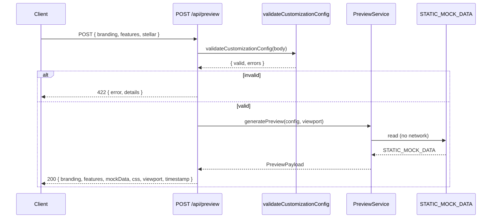
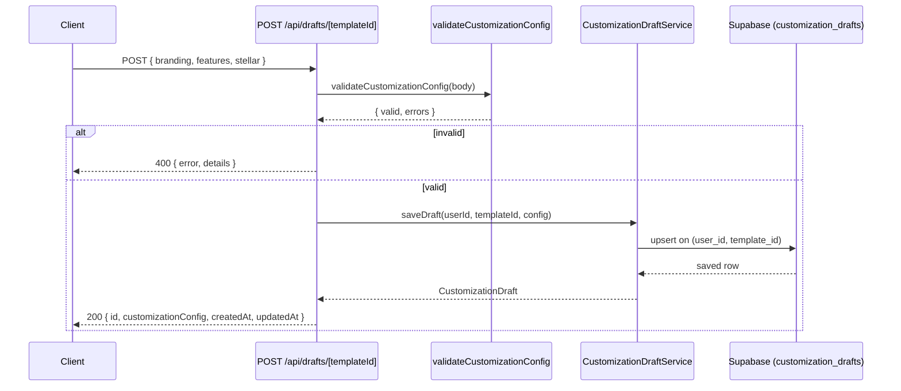

# Design Document: Customization Preview Persistence

## Overview

This feature establishes formal correctness guarantees for three tightly coupled subsystems: the `PreviewService`, the `CustomizationDraftService`, and the `validateCustomizationConfig` validator. It does not change the public API surface or database schema — it adds property-based tests, fills gaps in example-based tests, and hardens any service behaviour needed to satisfy the stated guarantees.

The three core concerns are:

1. **Preview stability** — `PreviewService.generatePreview` and `generateAllViewports` must be deterministic, must faithfully reflect the input config, and must never make network requests.
2. **Persistence round-trip** — a `CustomizationConfig` written to `customization_drafts` and read back must be semantically equivalent to the original.
3. **Normalization safety** — `normalizeDraftConfig` must always produce a structurally complete `CustomizationConfig` regardless of input shape, and must be idempotent.

---

## Architecture

The feature spans three layers of the Next.js monorepo:

```
packages/types/src/          ← shared type contracts (CustomizationConfig, ValidationResult, …)
apps/web/src/
  lib/customization/
    validate.ts              ← validateCustomizationConfig (Zod + business rules)
  services/
    preview.service.ts       ← PreviewService, generatePreviewCss, deriveLayoutMetadata
    customization-draft.service.ts  ← CustomizationDraftService, normalizeDraftConfig
  app/api/
    preview/route.ts         ← POST /api/preview
    drafts/[templateId]/route.ts    ← GET + POST /api/drafts/[templateId]
    drafts/deployment/[deploymentId]/route.ts  ← GET /api/drafts/deployment/[deploymentId]
    customization/validate/route.ts ← POST /api/customization/validate
```

Data flow for a preview request:



Data flow for draft persistence:



---

## Components and Interfaces

### `validateCustomizationConfig` (`lib/customization/validate.ts`)

```typescript
function validateCustomizationConfig(input: unknown): ValidationResult
```

- Parses `input` with `customizationConfigSchema` (Zod).
- Applies business rules: `HORIZON_NETWORK_MISMATCH`, `DUPLICATE_COLORS`.
- Returns `{ valid: true, errors: [] }` or `{ valid: false, errors: ValidationError[] }`.
- Pure function — no side effects, no I/O.

### `normalizeDraftConfig` (`services/customization-draft.service.ts`)

```typescript
function normalizeDraftConfig(raw: unknown): CustomizationConfig
```

- Deep-merges `raw` with `DEFAULT_CONFIG` using shallow spread per section.
- Handles `null`, `undefined`, and partial objects without throwing.
- Idempotent: `normalizeDraftConfig(normalizeDraftConfig(x))` equals `normalizeDraftConfig(x)`.

### `PreviewService` (`services/preview.service.ts`)

```typescript
class PreviewService {
  generatePreview(config: CustomizationConfig, viewport?: ViewportClass): PreviewPayload
  generateAllViewports(config: CustomizationConfig): Record<ViewportClass, PreviewPayload>
}

function generatePreviewCss(config: CustomizationConfig): string
function deriveLayoutMetadata(viewport: ViewportClass): LayoutMetadata
```

Key exported constants:
- `STATIC_MOCK_DATA: StellarMockData` — the single static fixture used for all previews.
- `VIEWPORT_CLASSES: ViewportClass[]` — `['desktop', 'tablet', 'mobile']`.
- `VIEWPORT_DIMENSIONS: Record<ViewportClass, { width: number; height: number }>`.

### `CustomizationDraftService` (`services/customization-draft.service.ts`)

```typescript
class CustomizationDraftService {
  saveDraft(userId: string, templateId: string, config: CustomizationConfig): Promise<CustomizationDraft>
  getDraft(userId: string, templateId: string): Promise<CustomizationDraft | null>
  getDraftByDeployment(userId: string, deploymentId: string): Promise<CustomizationDraft | null>
}
```

- `saveDraft` upserts on `(user_id, template_id)` — only one draft per user per template.
- `getDraft` returns `null` (not an error) when no row exists.
- `getDraftByDeployment` throws `'Forbidden'` when the deployment belongs to a different user.
- All retrieved rows pass through `normalizeDraftConfig` before being returned.

### API Routes

| Route | Method | Auth | Description |
|---|---|---|---|
| `/api/preview` | POST | required | Generate preview payload |
| `/api/drafts/[templateId]` | GET | required | Retrieve saved draft |
| `/api/drafts/[templateId]` | POST | required | Save/overwrite draft |
| `/api/drafts/deployment/[deploymentId]` | GET | required | Load draft via deployment |
| `/api/customization/validate` | POST | required | Validate config without persisting |

---

## Data Models

### `CustomizationConfig`

```typescript
interface CustomizationConfig {
  branding: {
    appName: string;          // 1–60 chars
    logoUrl?: string;         // valid URL
    primaryColor: string;     // hex (#RGB or #RRGGBB), must differ from secondaryColor
    secondaryColor: string;   // hex (#RGB or #RRGGBB)
    fontFamily: string;       // non-empty
  };
  features: {
    enableCharts: boolean;
    enableTransactionHistory: boolean;
    enableAnalytics: boolean;
    enableNotifications: boolean;
  };
  stellar: {
    network: 'mainnet' | 'testnet';
    horizonUrl: string;       // must match network
    sorobanRpcUrl?: string;
    assetPairs?: AssetPair[];
    contractAddresses?: Record<string, string>;
  };
}
```

### `ValidationResult`

```typescript
interface ValidationResult {
  valid: boolean;
  errors: ValidationError[];  // empty iff valid === true
}

interface ValidationError {
  field: string;   // dot-notation path, e.g. "stellar.horizonUrl"
  message: string;
  code: string;    // e.g. "HORIZON_NETWORK_MISMATCH", "DUPLICATE_COLORS"
}
```

### `CustomizationDraft` (service layer)

```typescript
interface CustomizationDraft {
  id: string;
  userId: string;
  templateId: string;
  customizationConfig: CustomizationConfig;  // always normalized
  createdAt: Date;
  updatedAt: Date;
}
```

### `customization_drafts` (Supabase table)

| Column | Type | Constraint |
|---|---|---|
| `id` | uuid | PK, default gen_random_uuid() |
| `user_id` | uuid | FK → auth.users |
| `template_id` | uuid | FK → templates |
| `customization_config` | jsonb | not null |
| `created_at` | timestamptz | default now() |
| `updated_at` | timestamptz | default now() |

Unique constraint: `(user_id, template_id)` — enforces one draft per user per template.

### `PreviewPayload` (current service shape)

```typescript
interface PreviewPayload {
  branding: BrandingConfig;
  features: FeatureConfig;
  mockData: StellarMockData;   // reference-equal to STATIC_MOCK_DATA
  css: string;
  viewport: { width: number; height: number; };
  timestamp: string;           // ISO 8601
}
```

### `LayoutMetadata`

```typescript
interface LayoutMetadata {
  viewportClass: ViewportClass;
  viewport: { width: number; height: number; };
  containerMaxWidth: number;   // <= viewport.width
  gridColumns: number;         // desktop > tablet > mobile
  sidebarCollapsed: boolean;   // false for desktop, true for tablet/mobile
}
```

---

## Correctness Properties

*A property is a characteristic or behavior that should hold true across all valid executions of a system — essentially, a formal statement about what the system should do. Properties serve as the bridge between human-readable specifications and machine-verifiable correctness guarantees.*

### Property 1: Config Preservation

*For any* valid `CustomizationConfig`, calling `PreviewService.generatePreview` must return a payload whose `branding`, `features`, and `stellar` fields are structurally equal to the input config.

**Validates: Requirements 1.1**

---

### Property 2: Preview Determinism

*For any* valid `CustomizationConfig` and any `ViewportClass`, calling `PreviewService.generatePreview` twice with the same arguments must return payloads that are structurally equal in all scalar fields (`css`, `viewport.width`, `viewport.height`, `branding.*`, `features.*`).

**Validates: Requirements 1.2**

---

### Property 3: Mock Data Isolation

*For any* valid `CustomizationConfig` and any `ViewportClass`, the `mockData` field of the returned `PreviewPayload` must be reference-equal to `STATIC_MOCK_DATA`, and no Stellar SDK or HTTP client method must be invoked during the call.

**Validates: Requirements 1.3, 3.1, 3.2, 3.6**

---

### Property 4: All-Viewports Completeness

*For any* valid `CustomizationConfig`, `PreviewService.generateAllViewports` must return an object with exactly the keys `desktop`, `tablet`, and `mobile`, each holding a non-null `PreviewPayload`.

**Validates: Requirements 1.4**

---

### Property 5: CSS Contains Branding Values

*For any* valid `CustomizationConfig`, `generatePreviewCss` must return a string that contains the `primaryColor`, `secondaryColor`, and `fontFamily` values from the input config.

**Validates: Requirements 1.5**

---

### Property 6: CSS Is Viewport-Invariant

*For any* valid `CustomizationConfig`, the `css` field must be identical across all three viewport entries returned by `generateAllViewports`.

**Validates: Requirements 1.6**

---

### Property 7: Viewport Width Ordering

*For any* valid `CustomizationConfig`, the `viewport.width` values returned by `generateAllViewports` must satisfy `desktop.viewport.width > tablet.viewport.width > mobile.viewport.width`.

**Validates: Requirements 2.1, 2.2**

---

### Property 8: Container Fits Viewport

*For any* `ViewportClass`, `deriveLayoutMetadata` must return a `containerMaxWidth` that is less than or equal to `viewport.width`.

**Validates: Requirements 2.3**

---

### Property 9: Grid Column Ordering

*For any* valid `CustomizationConfig`, the `gridColumns` values returned by `generateAllViewports` must satisfy `desktop.gridColumns > tablet.gridColumns > mobile.gridColumns`.

**Validates: Requirements 2.4, 2.5**

---

### Property 10: Sidebar Collapsed Invariant

*For any* `ViewportClass`, `deriveLayoutMetadata` must set `sidebarCollapsed` to `false` when the class is `desktop` and `true` when the class is `tablet` or `mobile`.

**Validates: Requirements 2.6, 2.7**

---

### Property 11: Mock Data Structural Completeness

*For any* valid `CustomizationConfig` and any `ViewportClass`, `mockData.recentTransactions` must be a non-empty array, `mockData.assetPrices` must be an object where every value is a finite positive number, and `mockData.accountBalance` must be a non-empty string.

**Validates: Requirements 3.3, 3.4, 3.5**

---

### Property 12: Normalization Structural Completeness

*For any* input (including `null`, `undefined`, empty objects, and partial objects), `normalizeDraftConfig` must return an object with all three top-level keys (`branding`, `features`, `stellar`) present and non-null, without throwing.

**Validates: Requirements 4.1, 4.2, 4.5**

---

### Property 13: Normalization Preserves Provided Fields

*For any* partial object that provides some branding, features, or stellar fields, `normalizeDraftConfig` must preserve those provided fields while filling missing fields with their default values.

**Validates: Requirements 4.3**

---

### Property 14: Normalization Idempotence

*For any* valid `CustomizationConfig` `c`, `normalizeDraftConfig(normalizeDraftConfig(c))` must be structurally equal to `normalizeDraftConfig(c)`.

**Validates: Requirements 4.4, 4.6**

---

### Property 15: Draft Persistence Round-Trip

*For any* valid `CustomizationConfig`, saving it via `CustomizationDraftService.saveDraft` and then retrieving it via `getDraft` with the same `userId` and `templateId` must return a draft whose `customizationConfig` is structurally equal to the saved config.

**Validates: Requirements 5.1, 5.6**

---

### Property 16: Draft Upsert Overwrites Previous

*For any* two valid `CustomizationConfig` values `c1` and `c2`, saving `c1` then saving `c2` for the same `(userId, templateId)` pair must result in `getDraft` returning `c2` (not `c1`).

**Validates: Requirements 5.2**

---

### Property 17: Invalid Config Rejected by Draft API

*For any* request body that fails `validateCustomizationConfig`, `POST /api/drafts/[templateId]` must return HTTP 400 with a `details` array and must not invoke `saveDraft`.

**Validates: Requirements 6.2**

---

### Property 18: Validator Valid/Errors Consistency

*For any* input, `validateCustomizationConfig` must return a `ValidationResult` where `errors` is an empty array if and only if `valid` is `true`.

**Validates: Requirements 8.5, 8.6**

---

### Property 19: Validator Accepts All Valid Configs

*For any* `CustomizationConfig` with matching `network`/`horizonUrl` and distinct `primaryColor`/`secondaryColor`, `validateCustomizationConfig` must return `{ valid: true, errors: [] }`.

**Validates: Requirements 8.1**

---

### Property 20: Validator Rejects Network Mismatch

*For any* `CustomizationConfig` where `stellar.network` is `mainnet` and `stellar.horizonUrl` is the testnet URL (or vice versa), `validateCustomizationConfig` must return `{ valid: false, errors: [{ code: 'HORIZON_NETWORK_MISMATCH', field: 'stellar.horizonUrl' }] }`.

**Validates: Requirements 8.2**

---

### Property 21: Validator Rejects Duplicate Colors

*For any* `CustomizationConfig` where `branding.primaryColor` equals `branding.secondaryColor`, `validateCustomizationConfig` must return `{ valid: false, errors: [{ code: 'DUPLICATE_COLORS', field: 'branding.secondaryColor' }] }`.

**Validates: Requirements 8.3**

---

## Error Handling

### Validation Errors (400 / 422)

- `POST /api/drafts/[templateId]` returns 400 (not 422) for invalid config shape — the draft API treats schema violations as bad requests, not unprocessable entities.
- `POST /api/preview` returns 422 for invalid config — the preview API uses 422 to distinguish semantic validation failures from malformed JSON (400).
- Both endpoints return a `details` array of `ValidationError` objects for field-level feedback.

### Authentication / Authorization (401 / 403)

- All routes are wrapped with `withAuth`. Unauthenticated requests receive 401 before any business logic runs.
- `getDraftByDeployment` throws `'Forbidden'` when the deployment's `user_id` does not match the authenticated user; the route handler maps this to 403.

### Not Found (404)

- `getDraft` returns `null` for missing drafts; the route handler maps this to 404.
- `saveDraft` throws `'Template not found'` when the template does not exist or is inactive; the route handler maps this to 404.

### Internal Errors (500)

- Unexpected Supabase errors are caught and returned as 500 with the error message. No stack traces are leaked to the client.

### Normalization Safety

- `normalizeDraftConfig` never throws. It treats any non-object input as an empty object and fills all missing fields with defaults. This means a corrupted JSONB value in the database will never crash the service layer.

---

## Testing Strategy

### Dual Testing Approach

Both unit tests and property-based tests are required. They are complementary:

- **Unit tests** verify specific examples, error conditions, and integration points.
- **Property tests** verify universal invariants across randomly generated inputs.

### Property-Based Testing Library

The project already uses **fast-check** (`^3.15.0`) for property-based testing. All property tests use `fc.assert` with `{ numRuns: 100 }` minimum.

Each property test must include a comment referencing the design property it validates:

```
// Feature: customization-preview-persistence, Property N: <property title>
```

### Test Files

| File | Type | Covers |
|---|---|---|
| `services/preview.property.test.ts` | Property | Properties 1–11 (PreviewService) |
| `services/customization-draft.property.test.ts` | Property | Properties 12–16 (normalization + persistence) |
| `lib/customization/validate.property.test.ts` | Property | Properties 17–21 (validator) |
| `services/customization-draft.service.test.ts` | Unit | Requirements 5.3, 5.4, 5.5 (null/error examples) |
| `app/api/drafts/[templateId]/route.test.ts` | Unit | Requirements 6.1, 6.3–6.7 (API examples) |
| `app/api/preview/route.test.ts` | Unit | Requirements 7.1, 7.3–7.6 (API examples) |

### Arbitraries

A shared `arbCustomizationConfig` arbitrary must generate configs that satisfy all business rules (matching network/horizonUrl, distinct colors). The existing arbitrary in `preview.property.test.ts` is the canonical reference:

```typescript
const arbCustomizationConfig = fc
  .tuple(arbHexColor, arbFontFamily, arbNetwork)
  .chain(([[primary, secondary], font, network]) =>
    fc.record({
      branding: fc.record({
        appName: fc.string({ minLength: 1, maxLength: 60 }),
        primaryColor: fc.constant(primary),
        secondaryColor: fc.constant(secondary),
        fontFamily: fc.constant(font),
      }),
      features: fc.record({
        enableCharts: fc.boolean(),
        enableTransactionHistory: fc.boolean(),
        enableAnalytics: fc.boolean(),
        enableNotifications: fc.boolean(),
      }),
      stellar: fc.record({
        network: fc.constant(network),
        horizonUrl: fc.constant(
          network === 'mainnet'
            ? 'https://horizon.stellar.org'
            : 'https://horizon-testnet.stellar.org'
        ),
      }),
    })
  );
```

### Unit Test Focus

Unit tests should cover:
- Happy-path examples for each API endpoint (correct status codes and response shapes).
- Specific error conditions: missing template (404), unauthenticated (401), forbidden (403), missing draft (404), malformed JSON (400).
- The `normalizeDraftConfig` edge cases: `null`, `undefined`, `{}`, partial branding.

Avoid writing unit tests that duplicate what property tests already cover (e.g., do not write a unit test for "valid config returns 200" if a property test already covers all valid configs).
